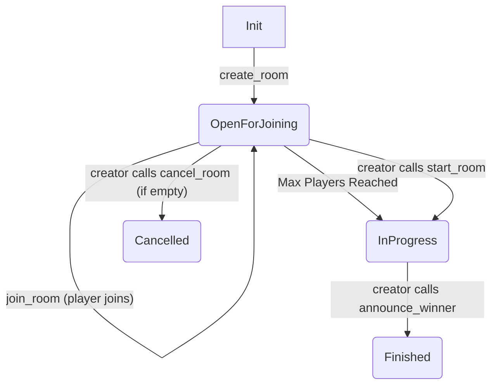

# PALAPA Fun Rooms 🎉

**PALAPA Fun Rooms** is a Solana smart contract (program) built with Anchor (v0.31.1) that enables the creation and management of on-chain "fun rooms." These rooms can be used for various purposes, such as simple games, event lobbies, or any scenario where participants might join, optionally pay an entry fee, and a winner is later announced to distribute collected funds.

The program handles room creation, player joining, fee collection into a secure vault, winner announcement, and distribution of the prize pool (minus creator and service fees).

[](https://www.anchor-lang.com/)
[](https://www.rust-lang.org/)
[](https://solana.com/)

## ✨ Features

*   **Room Creation:** Creators can initialize new rooms with custom parameters:
    *   `room_seed`: A unique identifier string for the room (scoped to the creator).
    *   `max_players`: The maximum number of players allowed in the room.
    *   `entry_fee`: The amount of SOL (in lamports) required to join the room (can be 0).
*   **Player Joining:** Players can join `OpenForJoining` rooms. If an `entry_fee` is set, it's transferred from the player to the room's vault.
*   **Room Start:** Creators can manually transition an `OpenForJoining` room to `InProgress`, even if it hasn't reached `max_players`.
*   **Winner Announcement:** The room creator can announce a winner once the room is `InProgress`.
*   **Prize Distribution:**
    *   The total prize pool (entry fees collected in the room's vault) is distributed.
    *   A **Creator Fee** (5%) is paid to the room creator.
    *   A **Service Fee** (3%) is paid to a predefined service wallet.
    *   The remaining amount, plus the vault's rent-exempt lamports, is transferred to the announced winner.
*   **Room Cancellation:** Creators can cancel `OpenForJoining` rooms if no players have joined, recovering the rent paid for the room and vault accounts.
*   **Secure Vaults:** Each room has its own Program Derived Address (PDA) acting as a vault to hold entry fees.
*   **Status Tracking:** Rooms progress through well-defined statuses: `OpenForJoining` -> `InProgress` -> `Finished` (or `Cancelled`).
*   **Timestamps:** Creation and end timestamps are recorded for each room.

## 📋 Table of Contents

*   [PALAPA Fun Rooms 🎉](#palapa-fun-rooms-)
    *   [✨ Features](#-features)
    *   [📋 Table of Contents](#-table-of-contents)
    *   [🧠 Core Concepts](#-core-concepts)
        *   [Room (`RoomData` PDA)](#room-roomdata-pda)
        *   [Vault (`RoomVault` PDA)](#vault-roomvault-pda)
        *   [Fees](#fees)
        *   [Room Lifecycle](#room-lifecycle)
    *   [🛠️ Getting Started](#️-getting-started)
        *   [Prerequisites](#prerequisites)
        *   [Installation & Setup](#installation--setup)
        *   [Building the Program](#building-the-program)
        *   [Running Tests](#running-tests)
        *   [Deploying](#deploying)
    *   [📜 Program Details](#-program-details)
        *   [Program ID](#program-id)
        *   [Instructions (IDL)](#instructions-idl)
            *   [`create_room`](#create_room)
            *   [`join_room`](#join_room)
            *   [`start_room`](#start_room)
            *   [`announce_winner`](#announce_winner)
            *   [`cancel_room`](#cancel_room)
        *   [Account Structures](#account-structures)
            *   [`RoomData`](#roomdata)
            *   [`RoomVault`](#roomvault)
        *   [Enums](#enums)
            *   [`RoomStatus`](#roomstatus)
        *   [Error Codes](#error-codes)
        *   [Key Constants](#key-constants)
    *   [🧪 Testing Highlights](#-testing-highlights)
    *   [🤝 Contributing](#-contributing)
    *   [📄 License](#-license)

## 🧠 Core Concepts

### Room (`RoomData` PDA)

Each fun room is represented by a `RoomData` account, which is a Program Derived Address (PDA).
*   **Seeds:** `["room", creator_pubkey, room_seed_string]`
*   **Purpose:** Stores all metadata about the room, including its status, players, fees, and creator.
*   **Space Allocation:** The `RoomData` account size is calculated dynamically during initialization based on the `room_seed` length. However, the `players` vector is allocated with a capacity defined by the `MAX_PLAYERS_ALLOWED` constant (currently 100) to ensure predictable space usage, regardless of the `max_players` requested for a specific room (as long as it's `<= MAX_PLAYERS_ALLOWED`).

### Vault (`RoomVault` PDA)

Each room also has an associated `RoomVault` PDA.
*   **Seeds:** `["vault", creator_pubkey, room_seed_string]`
*   **Purpose:** A simple PDA account (owned by System Program, 0 data space) that securely holds lamports collected from player entry fees.
*   **Security:** Only the program can authorize transfers from this vault using its PDA signature during winner announcement or room cancellation.

### Fees

*   **Creator Fee:** 5% of the total prize pool, paid to the room creator upon `announce_winner`.
*   **Service Fee:** 3% of the total prize pool, paid to a hardcoded `SERVICE_WALLET_PUBKEY` upon `announce_winner`.
*   Fees are calculated based on `BASIS_POINTS` (1% = 100 basis points).

### Room Lifecycle

A room progresses through the following states:



1.  **OpenForJoining:** The room is newly created and players can join.
2.  **InProgress:** The room is full, or the creator has manually started it. No more players can join. The creator can now announce a winner.
3.  **Finished:** A winner has been announced, and funds have been distributed. The room is concluded.
4.  **Cancelled:** The creator cancelled an empty `OpenForJoining` room. The room is concluded.

## 🛠️ Getting Started

### Prerequisites

*   **Rust:** [Install Rust](https://www.rust-lang.org/tools/install)
*   **Solana CLI:** [Install Solana CLI](https://docs.solana.com/cli/install-solana-cli-tools)
*   **Anchor Framework:** `avm install latest && avm use latest` ([Install Anchor](https://www.anchor-lang.com/docs/installation))
*   **Node.js & Yarn (or npm):** [Install Node.js](https://nodejs.org/) (which includes npm) and optionally [Yarn](https://classic.yarnpkg.com/en/docs/install/).

### Installation & Setup

1.  **Clone the repository:**
    ```bash
    git clone <your-repo-url>
    cd palapa-fun-rooms
    ```

2.  **Install JavaScript dependencies:**
    ```bash
    yarn install
    # or
    npm install
    ```

### Building the Program

Compile the Rust smart contract:

```bash
anchor build
```
This will generate the compiled program (`.so` file) in `target/deploy/` and the IDL (Interface Definition Language) JSON file in `target/idl/palapa_fun_rooms.json`. The TypeScript types for the client will also be generated in `target/types/palapa_fun_rooms.ts`.

### Running Tests

Ensure you have a local Solana test validator running. Anchor handles this automatically if one isn't detected.

```bash
anchor test
```
This command will:
1.  Build the program (if not already built).
2.  Deploy it to a local test validator.
3.  Run the TypeScript tests located in the `tests/` directory.

### Deploying

1.  **To Localnet/Testnet/Devnet:**
    ```bash
    # Make sure your Solana CLI is configured for the desired network
    solana config set --url localhost # or devnet, testnet
    solana config get

    # Airdrop SOL to your deployment keypair if needed
    solana airdrop 2 <YOUR_WALLET_ADDRESS>

    # Deploy
    anchor deploy
    ```
    After deployment, Anchor will output the new Program ID. You **must** update this ID in `declare_id!("...")` in `programs/palapa-fun-rooms/src/lib.rs` and in your client-side configurations (e.g., `program.programId` in tests or UI).

2.  **To Mainnet-Beta:**
    Deployment to Mainnet requires careful consideration, significant SOL for deployment costs, and thorough auditing. Follow the official Solana and Anchor documentation for mainnet deployment procedures.

## 📜 Program Details

### Program ID

The on-chain deployed Program ID is:
`Fu5sXvLemQ5meB4y3GWM4oacD2uDwbF8URFh2WpmCMeR`

*(Note: If you re-deploy, this ID will change. Always update it in `lib.rs` and client code.)*

### Instructions (IDL)

The program exposes the following instructions:

#### `create_room`
Creates a new game room and its associated vault.

*   **Arguments:**
    *   `room_seed: String`: A string used as a seed for PDA generation, unique per creator. Max length: 32 bytes.
    *   `max_players: u16`: Maximum number of players allowed (must be > 1 and <= `MAX_PLAYERS_ALLOWED`).
    *   `entry_fee: u64`: Lamports required to join (can be 0).
*   **Accounts (`Context<CreateRoom>`):**
    *   `creator: Signer`: The account creating the room (pays for rent).
    *   `room_data: Account<'info, RoomData>`: (Writable, PDA Init) The PDA account to store room details.
        *   Seeds: `[ROOM_SEED_PREFIX, creator.key().as_ref(), room_seed.as_bytes()]`
    *   `room_vault: AccountInfo<'info>`: (Writable, PDA Init) The PDA account to act as the room's vault.
        *   Seeds: `[VAULT_SEED_PREFIX, creator.key().as_ref(), room_seed.as_bytes()]`
        *   Owner: `SystemProgram` (space: 0)
    *   `system_program: Program<'info, System>`: Required for account creation.

#### `join_room`
Allows a player to join an existing, open room.

*   **Arguments:**
    *   `_room_seed: String`: The seed of the room to join (used for PDA derivation).
*   **Accounts (`Context<JoinRoom>`):**
    *   `player: Signer`: The account joining the room (pays entry fee if > 0).
    *   `room_data: Account<'info, RoomData>`: (Writable) The room being joined.
        *   Constraint: `room_data.creator` is used for PDA seed.
    *   `room_vault: AccountInfo<'info>`: (Writable) The room's vault to receive the entry fee.
    *   `system_program: Program<'info, System>`: Required for SOL transfer.

#### `start_room`
Allows the room creator to manually start a game if it's `OpenForJoining`.

*   **Arguments:**
    *   `_room_seed: String`: The seed of the room to start.
*   **Accounts (`Context<StartRoom>`):**
    *   `creator: Signer`: The account starting the room (must be `room_data.creator`).
    *   `room_data: Account<'info, RoomData>`: (Writable) The room to be started.
        *   Constraint: `has_one = creator`.

#### `announce_winner`
Called by the room creator to declare a winner and distribute funds from the vault.

*   **Arguments:**
    *   `_room_seed: String`: The seed of the room.
    *   `winner_pubkey: Pubkey`: The public key of the winning player.
*   **Accounts (`Context<AnnounceWinner>`):**
    *   `creator: Signer`: The account announcing the winner (must be `room_data.creator`).
    *   `room_data: Account<'info, RoomData>`: (Writable) The room for which the winner is announced.
        *   Constraint: `has_one = creator`.
    *   `room_vault: AccountInfo<'info>`: (Writable) The room's vault from which funds are paid out.
    *   `winner_account: AccountInfo<'info>`: (Writable) The account of the declared winner (receives prize).
        *   Constraint: `winner_account.key() == winner_pubkey`.
    *   `service_fee_recipient: AccountInfo<'info>`: (Writable) The account to receive the service fee.
        *   Constraint: `service_fee_recipient.key() == SERVICE_WALLET_PUBKEY`.
    *   `system_program: Program<'info, System>`: Required for SOL transfers.

#### `cancel_room`
Allows the room creator to cancel a room if it's `OpenForJoining` and has no players. Recovers rent from the vault to the creator.

*   **Arguments:**
    *   `_room_seed: String`: The seed of the room to cancel.
*   **Accounts (`Context<CancelRoom>`):**
    *   `creator: Signer`: The account cancelling the room (must be `room_data.creator`).
    *   `room_data: Account<'info, RoomData>`: (Writable) The room to be cancelled.
        *   Constraint: `has_one = creator`.
        *   Optional: Can be `close = creator` to reclaim rent from `room_data` account.
    *   `room_vault: AccountInfo<'info>`: (Writable) The room's vault. Rent is transferred back to creator.
        *   Optional: Can be `close = creator` to reclaim rent from `room_vault` account (after transfer).
    *   `system_program: Program<'info, System>`: Required for SOL transfer.

### Account Structures

#### `RoomData`
The main state account for a room.

```rust
#[account]
pub struct RoomData {
    pub creator: Pubkey,            // 32 bytes: The Pubkey of the room creator.
    pub room_seed: String,          // 4 + len bytes: The seed string used to derive this PDA.
    pub bump: u8,                   // 1 byte: PDA bump for RoomData.
    pub vault_bump: u8,             // 1 byte: PDA bump for RoomVault.
    pub status: RoomStatus,         // 1 byte (enum discriminant): Current status of the room.
    pub winner: Option<Pubkey>,     // 1 + 32 bytes: Pubkey of the winner, if announced.
    pub max_players: u16,           // 2 bytes: Max players allowed in this specific room.
    pub entry_fee: u64,             // 8 bytes: Entry fee in lamports.
    pub players: Vec<Pubkey>,       // 4 + (N * 32) bytes: List of players who joined. N is capacity (MAX_PLAYERS_ALLOWED).
    pub creation_timestamp: i64,    // 8 bytes: Unix timestamp of room creation.
    pub end_timestamp: Option<i64>, // 1 + 8 bytes: Unix timestamp of room finishing/cancellation.
}
```
*   **Total Size:** Calculated by `RoomData::calculate_space()`. Includes Anchor discriminator (8 bytes) and a buffer (100 bytes). The `players` vector is allocated based on `MAX_PLAYERS_ALLOWED` (100 players) for space calculation, not the `max_players` for the specific room. This ensures consistent account sizing for allocation.

#### `RoomVault`
A simple `AccountInfo` PDA used to hold lamports. It does not store any custom data (`space = 0`). Its lamports balance is the rent-exemption minimum plus any collected entry fees.

### Enums

#### `RoomStatus`
Represents the different states a room can be in.

```rust
#[derive(AnchorSerialize, AnchorDeserialize, Clone, PartialEq, Eq, Debug)]
pub enum RoomStatus {
    Created,        // Initial state (currently, create_room moves directly to OpenForJoining).
    OpenForJoining, // Players can join.
    InProgress,     // Room is full or started by creator; winner can be announced.
    Finished,       // Winner announced, funds distributed.
    Cancelled,      // Room cancelled by creator (if empty).
}
```
*   **Size:** 1 byte (for the enum discriminant).

### Error Codes

The program defines custom errors for various failure conditions:

| Error Code (Hex) | Error Code (Dec) | Name                       | Description                                                                        |
| :--------------- | :--------------- | :------------------------- | :--------------------------------------------------------------------------------- |
| `0x1770`         | 6000             | `InvalidMaxPlayers`        | Invalid number of maximum players specified (must be > 1).                         |
| `0x1771`         | 6001             | `InvalidEntryFee`          | Entry fee must be greater than zero. (Note: Test shows 0 fee is allowed)           |
| `0x1772`         | 6002             | `InvalidRoomSeed`          | Room seed is invalid (empty or too long).                                          |
| `0x1773`         | 6003             | `BumpSeedNotFound`         | Could not find PDA bump seed.                                                      |
| `0x1774`         | 6004             | `RoomNotJoinable`          | Room is not in the correct state to be joined.                                     |
| `0x1775`         | 6005             | `RoomFull`                 | The room is already full.                                                          |
| `0x1776`         | 6006             | `PlayerAlreadyJoined`      | This player has already joined the room.                                           |
| `0x1777`         | 6007             | `RoomNotInProgress`        | The room is not in progress, cannot announce winner.                               |
| `0x1778`         | 6008             | `WinnerNotInRoom`          | The declared winner is not listed as a player in this room.                        |
| `0x1779`         | 6009             | `WinnerAccountMismatch`    | The provided winner account does not match the winner pubkey.                      |
| `0x177a`         | 6010             | `VaultNotEmptyAfterPayout` | Vault account was not empty after payout/recovery. Check transfer logic.           |
| `0x177b`         | 6011             | `Unauthorized`             | Unauthorized: Only the room creator can perform this action.                       |
| `0x177c`         | 6012             | `CannotCancelRoomState`    | Room cannot be cancelled in its current state (must be Open/Created).              |
| `0x177d`         | 6013             | `CannotCancelRoomPlayersJoined` | Room cannot be cancelled because players have already joined.                     |
| `0x177e`         | 6014             | `CalculationOverflow`      | Arithmetic overflow during fee or payout calculation.                              |
| `0x177f`         | 6015             | `InvalidServiceWallet`     | The provided service fee recipient account does not match the expected address.    |
| `0x1780`         | 6016             | `InsufficientFundsForPayout` | Insufficient funds in vault to cover calculated fees and payout.                   |
| `0x1781`         | 6017             | `MaxPlayersExceedsLimit`   | Requested max players exceeds the program's limit used for space allocation.       |
| `0x1782`         | 6018             | `InvalidCreator`           | Invalid Creator account provided for seed derivation.                              |
| `0x1783`         | 6019             | `RoomNotOpenForStarting`   | Room is not in the OpenForJoining state, cannot be started.                        |

*(Note: The `InvalidEntryFee` error message "Entry fee must be greater than zero" seems to contradict the tests and program logic which allow zero entry fee. This might be a legacy message or an intended future constraint not currently enforced for zero.)*

### Key Constants

These constants define core behavior and limits of the program:

| Constant                   | Value                                       | Description                                                                 |
| :------------------------- | :------------------------------------------ | :-------------------------------------------------------------------------- |
| `ROOM_SEED_PREFIX`         | `b"room"`                                   | PDA seed prefix for `RoomData` accounts.                                    |
| `VAULT_SEED_PREFIX`        | `b"vault"`                                  | PDA seed prefix for `RoomVault` accounts.                                   |
| `CREATOR_FEE_BASIS_POINTS` | `500` (u64)                                 | 5.00% fee for the room creator.                                             |
| `SERVICE_FEE_BASIS_POINTS` | `300` (u64)                                 | 3.00% fee for the service wallet.                                           |
| `SERVICE_WALLET_PUBKEY`    | `FDKFLU6mUjfYZRRSrqbS9CPH87MFpae8JSH9Ddt79oRN` | The public key of the wallet receiving service fees. **IMPORTANT: Configure this before mainnet deployment.** |
| `BASIS_POINTS_DENOMINATOR` | `10000` (u64)                               | Denominator for calculating fees from basis points.                         |
| `MAX_ROOM_SEED_LEN`        | `32` (usize)                                | Maximum byte length for the `room_seed` string.                             |
| `MAX_PLAYERS_ALLOWED`      | `100` (usize)                               | Maximum number of players used for `RoomData.players` `Vec` space allocation. A room's `max_players` cannot exceed this. |

## 🧪 Testing Highlights

The project includes a comprehensive test suite in `tests/palapa-fun-rooms.ts` using Anchor's TypeScript testing framework with Mocha and Chai.

Key aspects tested:
*   **`create_room`:**
    *   Successful room creation with valid parameters.
    *   Creation with zero entry fee.
    *   Failures for invalid `max_players` (e.g., < 2, > `MAX_PLAYERS_ALLOWED`).
    *   Failures for invalid `room_seed` (empty, too long).
    *   Correct rent deduction and vault initialization.
*   **`join_room`:**
    *   Successful joining with and without entry fees.
    *   Correct SOL transfer for entry fees.
    *   Automatic transition to `InProgress` when room becomes full.
    *   Failures for joining full rooms, already joined rooms, or rooms in non-joinable states (`InProgress`, `Finished`, `Cancelled`).
*   **`start_room`:**
    *   (Functionality exists in `lib.rs`; specific tests for this instruction are not in the provided `test.ts` snippet but would typically cover successful start by creator and failure by non-creator or in wrong state).
*   **`announce_winner`:**
    *   Successful announcement and correct fund distribution (winner, creator fee, service fee).
    *   Handling of zero-entry-fee rooms (winner gets vault rent).
    *   Correct rounding for fee calculations (remainder to winner).
    *   Vault emptied completely after distribution.
    *   Failures for:
        *   Non-creator attempting to announce.
        *   Room not `InProgress`.
        *   Announced winner not in player list.
        *   Mismatch between `winner_pubkey` argument and `winner_account` provided.
        *   Incorrect `service_fee_recipient` account.
        *   Client-side failure if `service_fee_recipient` account is missing.
*   **`cancel_room`:**
    *   Successful cancellation of an empty, `OpenForJoining` room by the creator.
    *   Correct recovery of vault rent to the creator.
    *   Failures for:
        *   Non-creator attempting to cancel.
        *   Attempting to cancel a room with players.
        *   Attempting to cancel a room in `InProgress` or `Finished` state.
*   **Error Handling:** A robust `checkError` utility in tests verifies specific program errors by code, name, or message substring.
*   **Balance Checks:** Thorough checks of SOL balances before and after operations, accounting for transaction fees and rent.

The tests ensure the program behaves as expected under various scenarios, including edge cases and failure conditions, providing confidence in its correctness.
